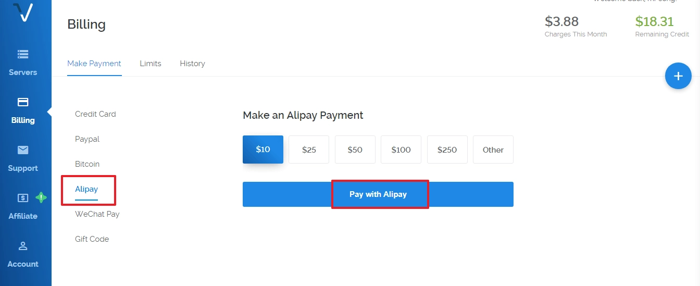
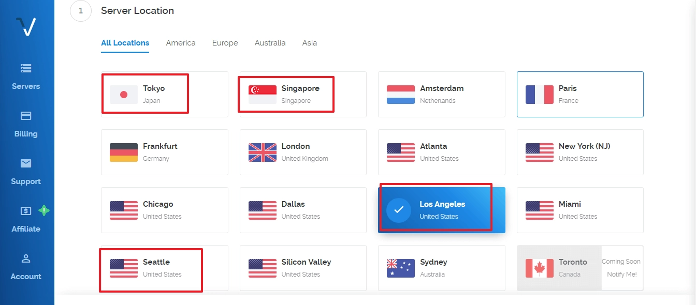
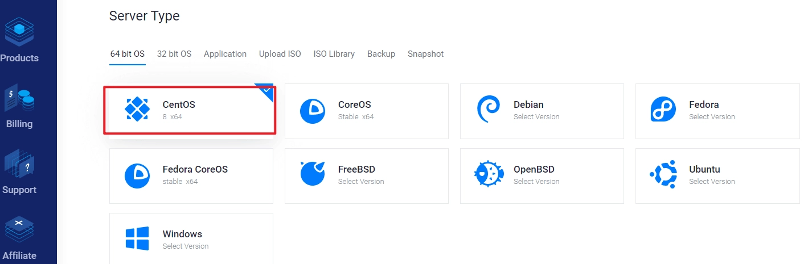
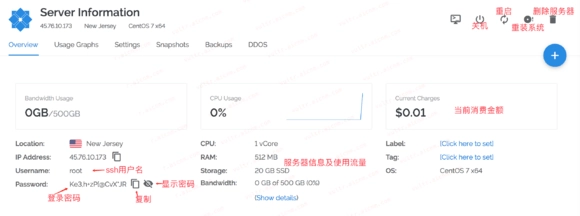

# 手把手教你注册Vultr并购买VPS服务器（2025最新版）

想搭建网站、部署应用或者搞点技术项目，第一步就是选台靠谱的服务器。国内服务器得备案，流程麻烦周期长，很多人直接选择国外服务器商。今天就来聊聊Vultr——这家按小时计费、支持支付宝、可以随时换IP的国际老牌厂商，特别适合新手入门和小型项目快速上线。

---

## 为什么选择Vultr?

说实话，市面上VPS服务商一大把，但Vultr有几个实在的优点：

**支付方便**：支持支付宝、PayPal、信用卡，甚至比特币。不用折腾美元信用卡,扫个码就能充值。

**按小时计费**：用多少算多少,不想用了随时删除实例,钱还在账户里。比包年包月灵活太多。

**免备案**：注册完充值就能用,不用提交一堆材料等审核。

**机房多**：全球十几个数据中心,亚洲有新加坡、日本、韩国,美国西海岸也不少,总能找到延迟低的。

**换IP自由**：IP被墙了?直接删掉重开一台,换个新IP,不额外收费。

这些特点对个人开发者、小团队或者想快速测试项目的人来说,真的挺友好。

## 注册Vultr账户

打开Vultr官网,首页就是注册界面,很直接:

填个邮箱,设置密码。注意密码要求有点严格——至少10位,包含大写字母、小写字母和数字。别太随意,但也别搞得自己都记不住。

填完点"Create Account"创建账户。

然后去你邮箱看看,会收到一封验证邮件。打开邮件点击验证链接就激活了。整个流程不到两分钟。

## 充值账户

注册完不能直接用,得先充钱。点击后台左侧的"Billing"(账单)进入充值页面:

选择Alipay(支付宝),最低充值10美元。输入金额后点"Pay with Alipay":

会跳出支付宝付款二维码,掏出手机扫一扫就行。秒到账,不用等。

充值完就可以开始买服务器了。这里补充一句,👉 [如果你打算长期使用或者部署多个项目,Vultr的灵活计费模式能帮你省不少成本](https://www.vultr.com/?ref=9738262-9J),特别是测试阶段频繁开关机的场景。

## 创建VPS服务器

点击页面右上角的蓝色加号"+",进入服务器购买页面:

### 选择机房位置

首先选数据中心。离你越近,理论上延迟越低。国内用户一般选:

- **亚洲机房**:新加坡、东京、首尔
- **美国西海岸**:洛杉矶、西雅图、硅谷

不确定选哪个?可以每个机房都测测ping值,选延迟最低的。

### 选择操作系统

这里有Ubuntu、CentOS、Debian等主流Linux发行版。新手推荐CentOS 8 x64或者Ubuntu 20.04——教程多,遇到问题好搜答案。

如果你要搭建网站环境,两个系统都差不多。要跑Docker容器或者特定应用,看软件要求选就行。

### 选择套餐配置

根据需求选配置。最便宜的套餐(以前3.5美元/月,现在可能略有调整):

- 1核CPU
- 512MB内存  
- 10-20GB SSD硬盘
- 500GB流量

这配置跑个人博客、小型网站、SS之类的够用。如果要跑数据库、大流量应用,建议往上选。

下面有个"Enable IPv6"可以勾上,免费的。其他自动备份、DDoS防护之类的附加服务要额外收费,新手用不着。

### 完成部署

最底下有个"Server Hostname"(主机名),随便填个英文标识或者不填都行,不影响使用。

检查一遍配置和价格,没问题就点"Deploy Now"(立即部署)。

等几十秒,服务器就创建好了。状态从"Installing"变成"Running"就说明可以用了。

## 查看服务器信息

创建完成后回到主面板,能看到你的服务器列表:

点击服务器名称进去,能看到详细信息:

重点关注三个信息:

- **IP Address**:服务器的公网IP地址
- **Username**:通常是root
- **Password**:默认密码(点眼睛图标显示)

拿到这三个信息,你就可以用SSH工具(Windows用Xshell或PuTTY,Mac用终端)连接服务器了。

## 一些实用建议

**测试IP可用性**:拿到IP后先ping一下,确保能连通。有些IP可能被墙,连不上就直接删除重开。

**修改默认密码**:第一次登录后立刻改密码,默认密码太简单不安全。

**开启防火墙**:装个防火墙或者配置iptables,别让服务器裸奔在公网上。

**定期快照备份**:Vultr支持手动创建快照,重要数据记得备份,虽然要额外收费但比丢数据强。

**监控流量**:套餐里的流量用完会限速或收费,后台能看流量使用情况,别超了。

---

## 总结

从注册到拿到一台能用的VPS,整个流程也就十来分钟。👉 [Vultr的按需付费和灵活配置,特别适合需要快速部署、频繁测试或者预算有限的场景](https://www.vultr.com/?ref=9738262-9J)。买完服务器只是第一步,后面还得装环境、配置软件、部署应用——但至少现在你有台自己能完全掌控的云服务器了。
